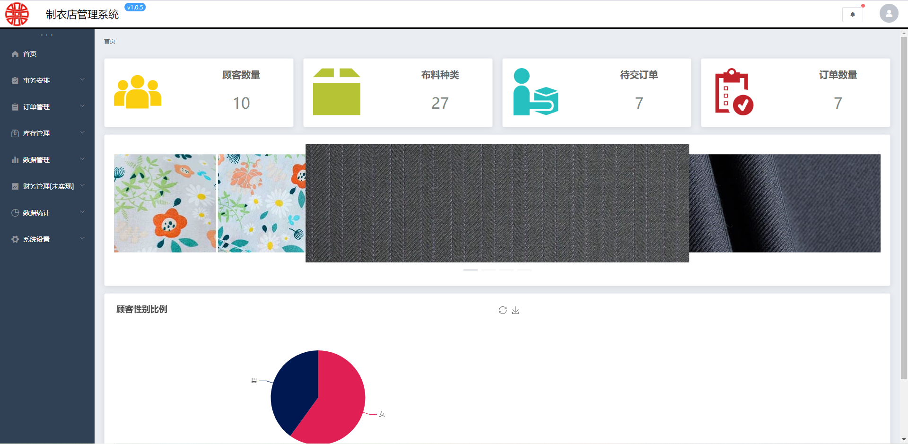
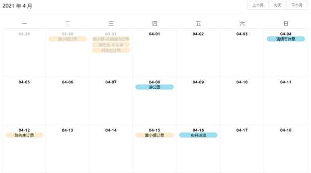
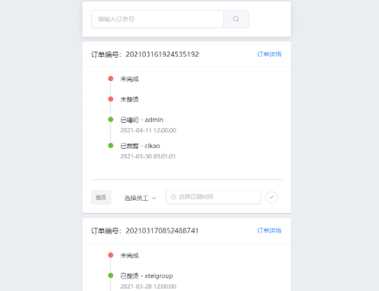
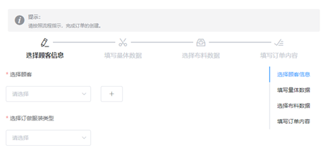
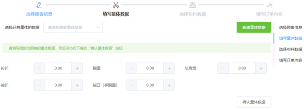
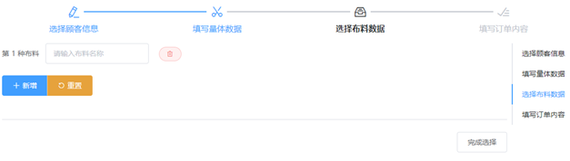
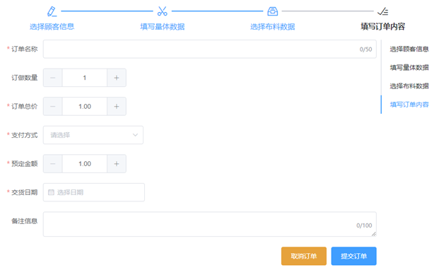
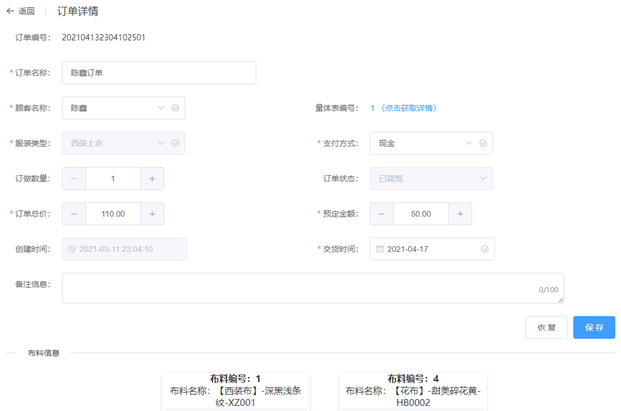
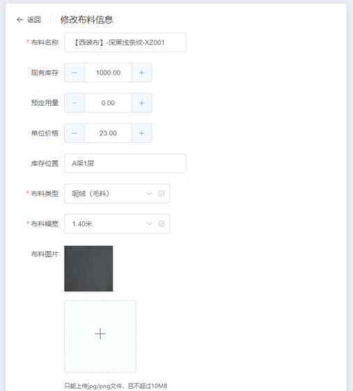
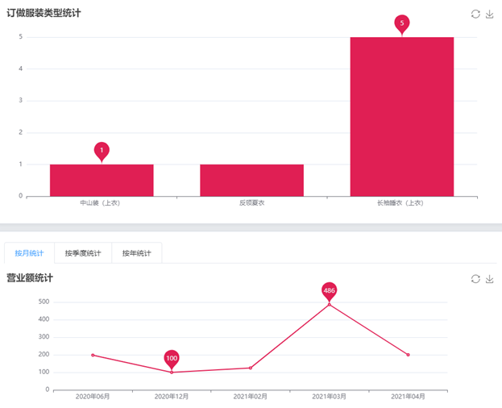

# 制衣店信息管理系统（前端）

### 项目简介

**前端框架**：Vue.JS  *2.6.11*

**路由工具**：Vue Router  *3.2.0*

**状态管理**：Vuex  *3.4.0*

**UI组件库**：Element UI  *2.4.5*

**数据可视化**：Echart  *5.0.2*

**CSS预编译**：Less *4.1.1*

**HTTP工具**：Axios  *0.21.1*

**其他工具库**：qs、moment.js、nprogress


## 系统功能模块设计

**事务安排模块**：事务安排模块共有事务日历和订单卡片两个子模块。事务月历子模块是通过用月历的形式展展示在当月的所有订单信息给用户，同时该事务月历还可以添加其它的安排，对于用户添加的安排事件，可以很方便地删除。订单卡片子模块是通过一张张卡片的形式展示每一张订单的每一阶段完成情况。

**订单管理模块**：共有新增订单、订单管理和顾客信息管理三个子模块。

**库存管理模块**：共有布料入库、布料库存管理和供应商信息管理三个子模块。

**数据管理模块**：共有服装类型数据、布料类型数据和服装用料数据三个子模块。

**数据统计模块**：共有库存统计和订单统计两个子模块。

**系统设置模块**：共有用户管理子模块、数据下载子模块和修改密码子模块。其中数据下载子模块允许用户将存储在数据库中的数据以Excel表格的形式下载至本地。

## 项目文件结构

```
│  App.vue
│  jsconfig.json
│  main.js
│  project.txt
│  
├─api
│      anthropometry.js
│      clothconsumption.js
│      clothtype.js
│      customer.js
│      downloadexcel.js
│      fabricinbound.js
│      fabricstock.js
│      fabrictype.js
│      home.js
│      login.js
│      neworder.js
│      order.js
│      plan.js
│      statistics.js
│      supplier.js
│      uploadfile.js
│      user.js
│      view.js
│      
├─assets		#静态文件
│  │  background.jpg
│  │  logo.png
│  │  trademark.png
│  │  webicon.ico
│  │  
│  ├─css
│  │      global.css
│  │      
│  ├─icon
│  │      Inventory.png
│  │      Load-Man.png
│  │      Product.png
│  │      User-Group.png
│  │      
│  └─image
│          1.jpg
│          2.jpg
│          3.jpg
│          4.jpg
│          
├─components	#组件
│  │  HelloWorld.vue
│  │  
│  ├─aside
│  │      Aside.vue
│  │      
│  ├─breadcrumb
│  │      Breadcrumb.vue
│  │      
│  ├─dialog
│  │      ClothConsumptionDialog.vue
│  │      ClothTypeDialog.vue
│  │      CustomerDialog.vue
│  │      FabricInfoDialog.vue
│  │      FabricReceiveDialog.vue
│  │      FabricTypeDialog.vue
│  │      SupplierDialog.vue
│  │      
│  ├─header
│  │      Header.vue
│  │      
│  ├─neworder
│  │      FirstStep.vue
│  │      FourthStep.vue
│  │      SecondStep.vue
│  │      ThirdStep.vue
│  │      
│  ├─pagination
│  │      Pagination.vue
│  │      
│  └─upload
│          UploadImage.vue
│          
├─data
│      anthropometrydata.js
│      clothconsumptiondata.js
│      clothtypedata.js
│      customerdata.js
│      fabricinfodata.js
│      fabricreceivedata.js
│      fabrictypedata.js
│      orderdata.js
│      selectdata.js
│      supplierdata.js
│      userdata.js
│      
├─plugins
│      element.js
│      
├─router
│      index.js
│      
├─store
│  │  index.js
│  │  
│  └─modules
│          routerpath.js
│          user.js
│          
├─utils	#工具包
│      check.js
│      moment.js
│      request.js
│      scrollTo.js
│      transfor.js
│      validate.js
│      
└─views
    │  About.vue
    │  Login.vue
    │  Welcome.vue
    │  
    ├─data
    │      ClothConsumption.vue
    │      ClothType.vue
    │      FabricType.vue
    │      
    ├─layout
    │      Home.vue
    │      
    ├─order
    │      Customer.vue
    │      NewOrder.vue
    │      Order.vue
    │      OrderDetail.vue
    │      
    ├─plan
    │      OrderCalendar.vue
    │      OrderCard.vue
    │      
    ├─settings
    │      ChangePassword.vue
    │      DownLoadExcel.vue
    │      Users.vue
    │      
    ├─statistics
    │      InventoryStatistics.vue
    │      OrderStatistics.vue
    │      
    └─stock
            FabricInbound.vue
            FabricStock.vue
            Supplier.vue
            UpdateFabricStock.vue
```

## 项目截图

+ 登录界面


+ 项目首页



+ 事务安排界面



+ 订单卡片界面



+ 新增订单界面









+ 订单详情界面




+ 修改布料信息界面



+ 订单统计界面




### 项目安装

```shell
npm install
```

### 编译并重新加载以进行开发
```shell
npm run serve
```

> 本项目为本人的本科毕业设计内容
